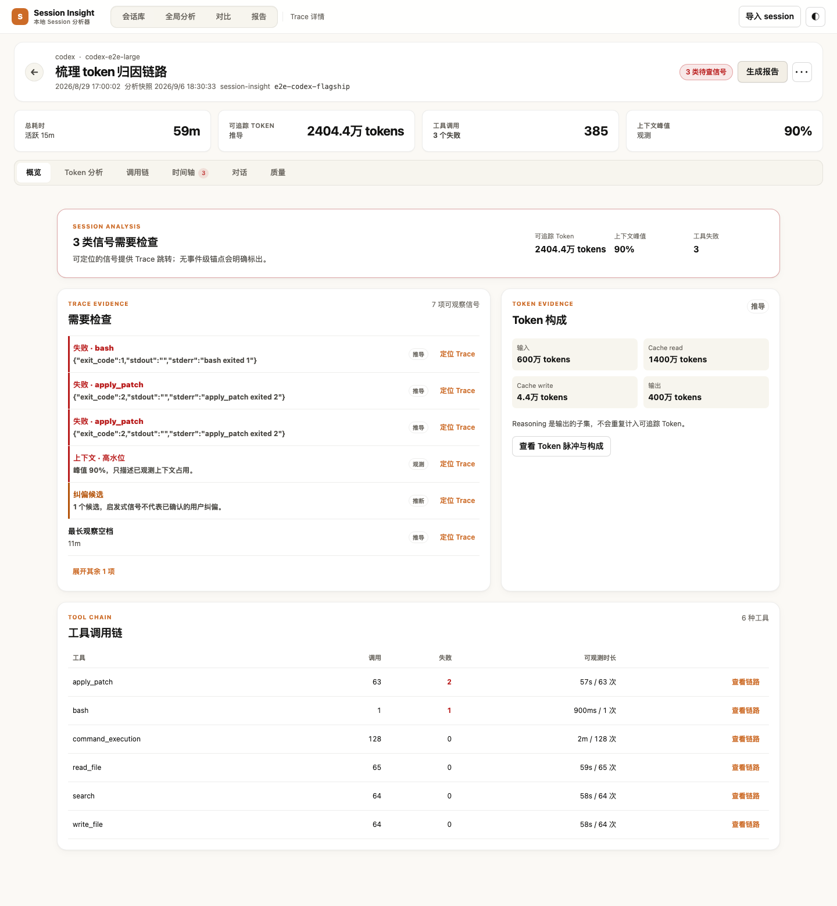

# Session Insight

**English | [简体中文](README.zh-CN.md)**

An independent, self-hosted analyzer for **Codex**, **Claude Code**, and **TraeX** session logs.

Your coding agent leaves a JSONL transcript behind after every run. Session Insight reads those files and answers the questions the transcript makes hard: where did the tokens go, which tool kept failing, how much of that four-hour run was actually idle, and what changed between the run that worked and the run that didn't.

It runs on your own computer or development machine: a single Go binary bound to loopback, plus a JSON index. No account or database. Remote deployments use an SSH tunnel, with session sync from the machine holding your logs.


## Quick start

Requires Node.js 20+, pnpm 10+, and Go 1.26.1+.

```bash
pnpm install
pnpm insight
```

Open <http://127.0.0.1:4788>. Upload one JSONL file to open its analysis, or use **扫描服务端** to scan recent sessions by provider and date range. The default scan covers the last seven days. Directory uploads are batched automatically. Initial setup may download dependencies or the Go toolchain; session analysis runs on the machine hosting the server.

## Remote deployment and sync

Run `pnpm install --frozen-lockfile` and `pnpm insight` in the remote checkout, then open a tunnel and sync from your computer:

```bash
# Terminal 1: keep running; replace the SSH destination
ssh -N -o ExitOnForwardFailure=yes -L 127.0.0.1:4789:127.0.0.1:4788 user@dev-host

# Terminal 2: from the local checkout, sync changed files every 60 seconds
pnpm insight:sync --url http://127.0.0.1:4789 --interval 60
```

Open <http://127.0.0.1:4789>. The sync client needs only Node.js and selects files modified within seven days by default; use `--days 0` for all history. Full JSONL snapshots travel through the tunnel and are deleted after parsing on the server. The existing 32 MiB per-file upload limit applies; skipped and failed files are reported. Larger files need server-side scanning on the machine holding the logs. **扫描服务端** scans the server's directories; file selection uploads from your browser's computer. See the [deployment and sync guide](docs/session-insight.md#远端开发机部署与同步) (Chinese).

## The five workspaces

The interface is in Chinese; the label shown in the app is given in parentheses.

| | What it's for |
|---|---|
| **Library** (会话库) | Every indexed run, identified by its conversation title rather than a UUID. Search across transcript bodies, filter by provider, model, tool, skill, error, or context risk. Header metrics cover all matches, not just the loaded page. Tick two rows to compare them. |
| **Insights** (全局分析) | Aggregate across everything indexed — token trends and composition, the projects burning the most tokens, the tools that fail most often, provider/model mix, risk surface. Every row links back into Library with the matching filter applied. |
| **Trace** | Opened by clicking a row in Library. Overview, token breakdown and hotspots, chronological tool calls, and a full-event timeline over one event stream. Select an event to see bounded excerpts, status, tokens, and context evidence in the inspector, or switch to the rendered conversation. |
| **Compare** (对比) | Two runs side by side, switchable between normalized and real elapsed time, with synchronized tool and skill diffs. |
| **Report** (报告) | Opened from Trace or Compare. Copy as Markdown, download as a single-file HTML, or print. |


*Screenshots use synthetic fixture data.*



## What it reads

Scanning covers the session directories of the current user:

| Provider | Paths |
|---|---|
| Codex | `~/.codex/sessions`, `~/.codex/archived_sessions` |
| Claude Code | `~/.claude/projects` (recursive) |
| TraeX | `~/.trae/cli/sessions`, legacy `~/.trae/sessions` |

Provider is detected from file content, not location, so uploaded files work the same way. One scan is capped at 512 MB and 10,000 files; anything beyond that is reported as skipped rather than silently dropped. Use the `providers` and `days` parameters to narrow a large history.

## Privacy

This tool exists to read your private transcripts, so its boundaries are deliberate:

- **Loopback only.** The server refuses to start on a non-loopback address. There is no auth layer, and remote access uses an SSH tunnel.
- **Your session files are never modified.** Scanning aggregates and reads; it never writes, moves, or deletes anything under `~/.codex`, `~/.claude`, or `~/.trae`. Clearing the index inside the app removes only the index.
- **The index holds no transcript bodies.** `index.json` stores searchable run summaries plus one title line each. Event traces live separately in `runs/<run-id>/trace.json`.
- **Excerpts are bounded.** Conversation turns cap at 8 KiB, tool input/output/errors at 640 bytes. Full transcripts and original file paths are never retained in the analysis store.
- **Uploads are transient.** Uploaded files sit in a protected temp directory only for the duration of the parse, then get deleted.
- **Zero third-party Go dependencies.** The server is standard library only, and CI fails the build if a dependency appears.

Data lands in your OS config directory by default — `~/Library/Application Support/session-insight/index.json` on macOS, `~/.config/session-insight/index.json` on Linux.

## Honest numbers

Every value carries an evidence label — `exact`, `derived`, `estimated`, `inferred`, `observed`, `heuristic`, `unknown`, or `unavailable` — that bounds how far you can read it. A missing field renders as `—`, never as `0`: a run with no observed token counts did not use zero tokens. Correction signals are shown as candidates, not confirmed mistakes. `Tracked tokens` sums input, cache read, cache write, and output only, since reasoning is a subset of output and would otherwise be double-counted.

## Configuration

```bash
SESSION_INSIGHT_ADDR=127.0.0.1:5799 pnpm insight     # listen elsewhere (loopback only)
SESSION_INSIGHT_DATA="$PWD/.session-insight/index.json" pnpm insight   # index location
```

## Development

```bash
make check       # typecheck + lint + unit tests, both languages
make test-go     # Go tests
make test-ts     # Vitest
make test-e2e    # Playwright, against a real server
```

| Path | |
|---|---|
| `apps/session-insight/` | React 19 + Vite frontend |
| `server/internal/sessioninsight/` | Session log parser — pure standard library |
| `server/internal/sessionstore/` | HTTP handlers and the JSON index store |
| `server/cmd/session-insight/` | Entry point |

`docs/session-insight.md` (Chinese) is the detailed behavior spec. `AGENTS.md` holds the rules for AI agents working in this repository.

## Status

Private project. Not licensed for redistribution.
