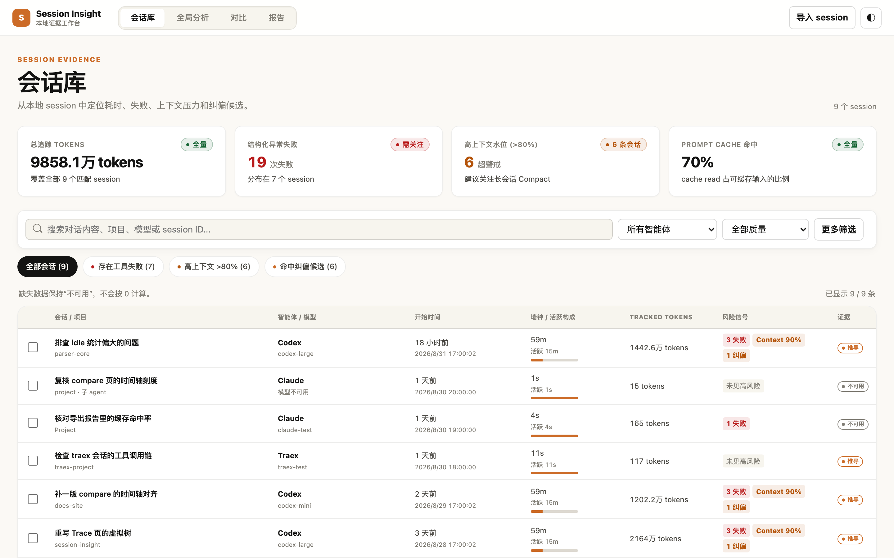
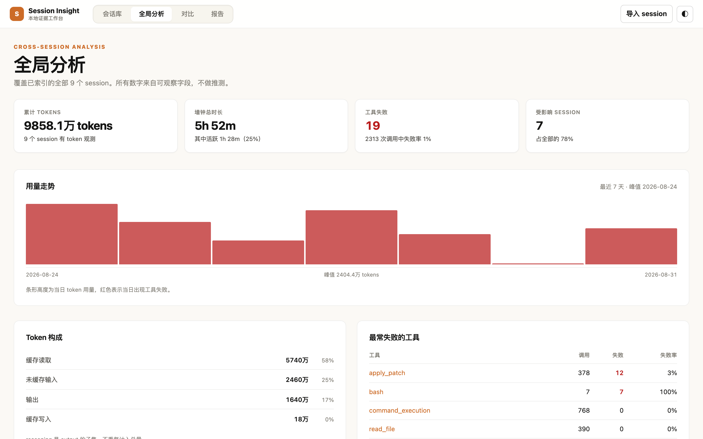

# Session Insight

**[English](README.md) | 简体中文**

只在本机运行的 **Codex**、**Claude Code**、**TraeX** 会话分析器。

编码 agent 每跑一次就留下一份 JSONL 记录。Session Insight 读这些文件，回答那些直接翻记录很难回答的问题：token 花在哪了、哪个工具一直在失败、四个小时的 run 里有多少其实是空等、跑通的那次和没跑通的那次到底差在哪。

它完全跑在你自己的机器上——一个绑定回环地址的 Go 二进制，加一份本地 JSON 索引。不需要账号，不需要数据库，不发任何网络请求。



## 快速开始

需要 Node.js 20+、pnpm 10+、Go 1.26+。

```bash
pnpm install
pnpm insight
```

打开 <http://127.0.0.1:4788>。点「扫描本机」索引机器上已有的 session，或者直接上传 JSONL 文件和目录。

## 五个工作区

| | 用来做什么 |
|---|---|
| **会话库** | 全部已索引的 run，每行以会话标题而不是 UUID 作为主标识。可搜索对话正文，按 provider、模型、工具、Skill、错误、上下文风险筛选。顶部指标覆盖全部匹配结果，不只是已加载的当页。勾选两条可直接比较。 |
| **全局分析** | 跨全部已索引 session 的聚合——token 走势与构成、最耗 token 的项目、最常失败的工具、provider/模型构成、风险面。每一行都可点击，带对应筛选跳回会话库。 |
| **Trace** | 从会话库点某一行进入。树、瀑布图，以及工具 / token / 上下文三条同步轨道共用同一份事件数据。选中事件会在 Inspector 中显示有限摘录、状态、token 和上下文证据，也可切到按 Markdown 渲染的对话页。 |
| **对比** | 两条 session 并排比较，可在标准化时间与共同真实时间之间切换，并同步筛选 Tool / Skill 差异。 |
| **报告** | 从 Trace 或对比页打开，可复制 Markdown、下载单文件 HTML 或打印。 |



*截图使用合成的 fixture 数据。*

## 读取哪些数据

扫描覆盖当前用户的 session 目录：

| Provider | 路径 |
|---|---|
| Codex | `~/.codex/sessions`、`~/.codex/archived_sessions` |
| Claude Code | `~/.claude/projects`（递归） |
| TraeX | `~/.trae/cli/sessions`、旧版 `~/.trae/sessions` |

provider 按文件内容识别而不是按位置，所以上传的文件同样有效。单次扫描上限 512 MB、10000 个文件；超出部分会明确计入「已跳过」，不会悄悄丢弃。历史很多时，可以用 `providers` 和 `days` 参数缩小范围。

## 隐私边界

这个工具的用途就是读你的私有记录，所以它的边界是刻意设计的：

- **只绑回环地址。** server 在非回环地址上会拒绝启动。它没有鉴权层，因为外部根本够不着它。
- **不改动你的 session 文件。** 扫描只做聚合和读取，从不写入、移动或删除 `~/.codex`、`~/.claude`、`~/.trae` 下的任何东西。界面里的清除操作只删索引。
- **索引不保存对话正文。** `index.json` 只存可搜索的 run 摘要，外加每条一行的会话标题。事件 Trace 独立存放在 `runs/<run-id>/trace.json`。
- **摘录有长度上限。** 对话轮次上限 8 KiB，工具输入 / 输出 / 错误上限 640 字节。不保存完整 transcript，也不保存原始文件路径。
- **上传是临时的。** 上传文件只在解析期间留在受保护的临时目录，解析完即删除。
- **Go 侧零第三方依赖。** server 只用标准库，CI 会在出现依赖时直接让构建失败。

数据默认落在操作系统的用户配置目录：macOS 是 `~/Library/Application Support/session-insight/index.json`，Linux 是 `~/.config/session-insight/index.json`。

## 数字的可信度

每个值都带证据标签——`exact`、`derived`、`estimated`、`inferred`、`observed`、`heuristic`、`unknown`、`unavailable`——限定这个数能被解读到什么程度。缺失字段显示 `—` 而不是 `0`：一条没有观测到 token 计数的 run，不等于它花了零个 token。纠偏信号按候选展示，不是已确认的错误。`Tracked tokens` 只累加 input、cache read、cache write 和 output，因为 reasoning 是 output 的子集，重复计入会虚高。

## 配置

```bash
SESSION_INSIGHT_ADDR=127.0.0.1:5799 pnpm insight     # 换监听地址（仅限回环）
SESSION_INSIGHT_DATA="$PWD/.session-insight/index.json" pnpm insight   # 换索引位置
```

## 开发

```bash
make check       # 两种语言的 typecheck + lint + 单测
make test-go     # Go 测试
make test-ts     # Vitest
make test-e2e    # Playwright，会真启一个 server
```

| 路径 | |
|---|---|
| `apps/session-insight/` | React 19 + Vite 前端 |
| `server/internal/sessioninsight/` | 会话日志解析器——纯标准库 |
| `server/internal/sessionstore/` | HTTP handler 与 JSON 索引存储 |
| `server/cmd/session-insight/` | 入口 |

`docs/session-insight.md` 是详细行为说明。`AGENTS.md` 是 AI agent 在本仓库工作的规则。

## 状态

私有项目，未授权对外分发。
