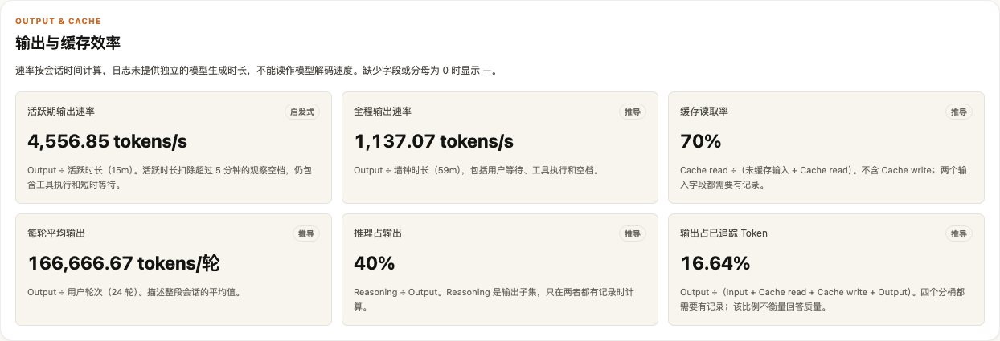

# Session Insight

Session Insight 是一个由自己运行的 Codex / Claude Code / TraeX session 分析器。它提供一个只监听回环地址的 server 和浏览器前端：可以导入 JSONL 文件或目录、扫描服务所在机器的 session、按条件搜索，并查看 token 脉冲、Trace / 瀑布图、工具、Skill、验证、子 agent、空闲间隔和可能纠偏等指标。

页面由五个工作区组成：

- **Library**：支持最近开始、Token 最多、耗时最长、工具调用最多和上下文最高排序。每行以会话标题（取自首条 user prompt）作为主标识，而不是 session UUID；可搜索对话内容，也可按 provider、模型、工具、Skill、错误和上下文风险筛选；勾选两条可直接比较。顶部指标覆盖全部匹配结果，不只是已加载的当页。
- **全局分析**：跨全部已索引 session 的聚合视图——token 走势与构成、最耗 token 的项目、最常失败的工具、provider/模型构成和风险面。每一行都可点击，带对应筛选跳回 Library。
- **单会话分析**：概览、Token 分析、调用链、时间轴、对话、质量共用同一份事件数据。概览按具体失败、上下文与纠偏候选组织线索；Token 页展示构成和最大消耗事件；调用链按时间显示每次工具调用的输入、结果、耗时和父级关系；时间轴提供虚拟事件树、执行分布和 token/context 图表。选中事件后，Inspector 展示有限摘录与关系。
- **Compare**：并排比较两条 session，可在标准化时间与共同真实时间之间切换，并同步筛选 Tool / Skill 差异。两侧以会话标题标识——同一 session 派生的多个子 agent run 共用一个 session ID，只显示 ID 会让两条不同的 run 看起来一样。
- **Report**：从 Trace 或 Compare 打开，可复制 Markdown、下载单文件 HTML 或打印。

## 启动

在仓库根目录执行：

```bash
pnpm insight
```

命令会先构建 `@session-insight/app`，再启动 Go server。打开 <http://127.0.0.1:4788> 即可使用。需要本机已安装 Node.js、pnpm 和 Go。

这个入口是独立工具，不读取仓库的 `.env`，不要求登录、workspace 或 PostgreSQL。

如需换端口或数据位置，可以覆盖环境变量：

```bash
SESSION_INSIGHT_ADDR=127.0.0.1:5799 pnpm insight
SESSION_INSIGHT_DATA="$PWD/.session-insight/index.json" pnpm insight
```

`SESSION_INSIGHT_ADDR` 是监听地址，格式为 `host:port`。`SESSION_INSIGHT_DATA` 是本地分析索引文件路径；父目录会自动创建。未设置时，server 使用操作系统的用户配置目录下的 `session-insight/index.json`：macOS 通常是 `~/Library/Application Support/session-insight/index.json`，Linux 通常是 `~/.config/session-insight/index.json`。

## 远端开发机部署与同步

支持在自己的远端开发机运行服务，通过 SSH 隧道访问；不需要开放 HTTP 端口或增加账号系统。下文以 `user@dev-host` 为例，替换成你的 SSH 登录目标。

### 启动远端服务

将包含同步功能的仓库版本放到远端开发机，在远端仓库根目录执行（需要 Node.js、pnpm、Go）：

```bash
pnpm install --frozen-lockfile
pnpm insight
```

服务默认监听远端的 `127.0.0.1:4788`。需要断开 SSH 后继续运行时，在远端的 tmux 会话中执行上述启动命令。分析索引默认在远端用户配置目录；也可在启动时设置 `SESSION_INSIGHT_DATA`。

### 建立访问隧道

在自己的电脑上执行，并保持该终端运行：

```bash
ssh -N -o ExitOnForwardFailure=yes -o ServerAliveInterval=30 -o ServerAliveCountMax=3 \
  -L 127.0.0.1:4789:127.0.0.1:4788 user@dev-host
```

浏览器打开 <http://127.0.0.1:4789>。本地使用 4789，避免与本机运行的 Session Insight 默认端口冲突。服务器仍只监听回环地址；不要将 `SESSION_INSIGHT_ADDR` 改成开发机 IP 或 `0.0.0.0`。

### 从日志所在机器同步

在自己的电脑上另开终端，在本地仓库根目录运行：

```bash
# 同步最近 7 天修改过的会话文件
pnpm insight:sync --url http://127.0.0.1:4789

# 每轮完成后等待 60 秒，再同步新增和有变化的文件；Ctrl-C 停止
pnpm insight:sync --url http://127.0.0.1:4789 --interval 60

# 全部历史，或只同步一种来源
pnpm insight:sync --url http://127.0.0.1:4789 --days 0
pnpm insight:sync --url http://127.0.0.1:4789 --provider claude
```

同步端只需要 Node.js；也可直接运行 `node scripts/sync-session-insight.mjs --url http://127.0.0.1:4789`，不必在本机启动 Go 服务或构建前端。`--home` 指定包含 `.codex`、`.claude`、`.trae` 的用户目录，默认当前用户目录。只读取默认会话根中的 `.jsonl` 文件，Claude 的 `backups` / `history` / `sessions` 子目录与符号链接会跳过。`--days` 按文件修改时间筛选；页面扫描则按日志内的会话结束时间筛选，两者含义不同。

每个有变化的文件作为完整快照上传，服务端按原始会话身份新增或更新，不按追加行独立分析。Claude 子 agent 的目录关系会保留。同一轮按文件修改时间从旧到新上传，使 live / archived 副本中修改时间较新的快照最后写入。同步不会传播源文件删除；同一来源只运行一个同步进程，避免不同快照相互覆盖。多台机器可分别建立隧道、运行命令，分析结果汇入同一个远端索引；同一会话的多个副本仍视为同一会话，最后一次导入生效。

本地状态记录文件指纹与远端 run ID，不记录原始路径或对话正文，权限为 `0600`。默认保存在用户配置目录的 `session-insight/sync/` 下，按目标地址和源用户目录隔离；`--state` 可指定文件。未变化且远端仍存在的记录不再上传；远端删除记录或清空索引后，下次同步会重新导入选定范围内的记录。服务升级后如需用新解析规则重算，添加 `--force`。

同步会经 SSH 传输完整 JSONL。远端沿用上传的处理方式：原文只在解析期间暂存，结束后删除，长期保存摘要和有限 Trace 摘录。不要对运行中的索引目录做 rsync 覆盖；同步命令通过现有导入接口写入。

单文件上限为 **32 MiB**，单轮最多处理 **512 MiB / 10,000 个待处理文件**。未变化文件不占上传预算，剩余文件可在后续轮次继续处理。超过单文件上限的文件不会拆分或截断，需要在日志所在机器运行服务并使用页面扫描分析。跳过、读取期间变化、导入失败及解析警告均在终端报告；失败文件下次重试。单次运行有跳过或失败时返回非零状态；定时模式继续重试，进度以每轮终端输出为准。同步完成后刷新浏览器查看最新分析。

页面里的「扫描服务端」读取远端当前用户的会话目录；「选择文件 / 目录」从浏览器所在电脑上传。页面不直接读取另一台机器的目录。

## 导入和分析

选择一个 JSONL 文件导入，成功后直接打开该 session；有跳过项或解析警告时先保留反馈供检查。也可以选择包含 session 文件的目录，前端按每批最多 20 文件、32 MB 分批提交，显示进度和累计结果；中途失败时说明已完成数量，已导入部分保留。Codex、Claude Code 与 TraeX 文件会按内容自动识别；TraeX 的 `model_provider` 为 `trae` 或 `traex` 时都会归一为 provider `traex`。导入结束后可以按 provider、model、项目、时间、工具、Skill、错误、纠偏、上下文风险和关键词搜索。

也可以使用“扫描服务端”读取服务所在机器当前用户可访问的 Codex、Claude Code 与 TraeX session。扫描入口可选择最近 1 天、7 天、30 天或全部历史，以及单个 provider；默认最近 7 天。首次扫描后的新增、更新、跳过数量与警告会保留在会话库。TraeX 会扫描当前目录 `~/.trae/cli/sessions` 和旧版目录 `~/.trae/sessions`。扫描只产生聚合结果，不修改原始 session 文件。

单次扫描受总字节上限约束（默认 512 MB）；超出后剩余文件会计入 `filesSkipped`。session 很多时，可用 `providers` 参数分别扫描某一类，或提高 `days` 覆盖更早的记录。

### 会话标题与内容搜索

每条 run 会从首条 user prompt 提取一行标题用于识别。`<teammate-message summary="…">` 这类结构化外壳会取其 summary，纯标签行会跳过。没有 user 轮次的 run（例如空会话）不产生标题，界面回退为「项目 · 短 ID」。

关键词搜索同时匹配标题、对话正文、原始 session ID、provider、model、项目、工具名和 Skill 名。命中正文时，列表行会显示匹配片段，说明这条为什么被选中。对话正文的搜索索引在首次搜索时从 trace 文件懒加载到内存，不写入磁盘索引。

### 分析当前 session

1. 从会话库打开记录，先看概览的具体失败摘录、上下文峰值和纠偏候选。可定位的线索直接跳转 Trace；缺少锚点的汇总项会说明限制。
2. 在 **Token 分析** 查看未缓存输入、cache read、cache write、output 的构成与精确数量，按日志父级关系汇总到用户轮次，并从高消耗轮次或最大消耗脉冲定位时刻。脉冲的父事件或 turn 只提供上下文，不能据此把消耗归因到某个工具。Reasoning 是 output 子集。
3. 在 **调用链** 按工具、失败或结果未判定筛选，也可以搜索输入、输出和错误。每页 40 条，每次调用展示父级、输入、返回结果、错误和可观测耗时。顺序代表记录先后，父级代表日志提供的关系，不推断工具和模型间的因果。
4. 在 **时间轴** 搜索命令或错误，选择事件看 Inspector；可继续查看父子关系和上一条、下一条。来自其他视图的跳转会展开目标遥测、清除冲突筛选并恢复可见时间范围。筛选、视图和选中事件保存在 URL，刷新可恢复。
5. 在 **质量** 查看 Token、工具、上下文、事件轨迹和 Skill 归因的来源标签。工具结果缺少结构化状态时显示“结果未判定”，不会把它当成成功；无数据也不会判定运行稳定。

概览与 Token 分析页提供输出与缓存效率；Token 页展示完整指标及公式。下图使用测试数据：



| 指标 | 计算口径 | 阅读限制 |
| --- | --- | --- |
| 活跃期输出速率 | Output ÷ 活跃时长，单位 tokens/s | 活跃时长扣除超过 5 分钟的观察空档，仍含工具执行和短时等待。 |
| 全程输出速率 | Output ÷ 墙钟时长，单位 tokens/s | 包含用户等待、工具执行与空档。 |
| 缓存读取率 | Cache read ÷（未缓存输入 + Cache read） | 不含 Cache write；两个分桶都需要有记录。 |
| 每轮平均输出 | Output ÷ 用户轮次 | 描述整段会话的平均值，不代表每一轮都消耗这些 Token。 |
| 推理占输出 | Reasoning ÷ Output | Reasoning 是输出子集；缺少任一项时不可用。 |
| 输出占已追踪 Token | Output ÷（Input + Cache read + Cache write + Output） | 四个分桶都需要有记录；该比例不衡量回答质量。 |

日志未提供独立的模型生成时长，因此两种输出速率是会话级指标，不能读作模型解码速度。指标保留源字段质量：例如 Claude 的输出标为估算，依赖活跃区间划分的速率标为启发式或保留更弱的源质量。时间戳不完整时另行提示。字段缺失或分母为 0 显示 `—`，明确记录的 0 保持 0；极小非零值及接近 100% 的比例用边界符号显示，避免舍入成 0 或完全命中。

详情页展示分析快照时间。正在进行的 session 需要重新扫描或导入后更新；页面不会持续读取原始日志。扫描和导入入口在小屏也可使用。

### 事件降噪

Trace 默认完整展示有效事件，不按数量抽样；“标准采样”和“重点摘要”是可选的精简视图。搜索命令、输入、输出、错误或事件 ID，以及类型、工具、失败筛选，始终覆盖全部匹配事件。

事件列表默认不显示纯遥测事件——`Token pulse` 和没有文本的 `Reasoning`。它们只驱动下方的 Token 变化与上下文压力图表，本身不代表发生了什么；频繁的遥测记录会淹没工具调用和对话。工具栏的「遥测事件 N」按钮可以随时显示全部。

时长按实测值显示：亚秒事件显示 `37ms`，十秒内显示一位小数，没有实测时长的瞬时事件不显示时长而不是显示 `0s`。事件列表每行在工具名之后附一段来源于输入的短提示（`bash` 显示命令、`edit` 显示文件路径），因为一次 run 里三十行都叫 `bash` 时只看工具名无法定位。检查器的「上一条 / 下一条」在当前列出的事件之间移动，与列表计数一致；从别处跳转到一个被折叠的遥测事件时会自动展开遥测。

### 对话渲染

对话页按 Markdown 渲染正文——标题、粗体、行内代码、围栏代码、列表、表格、引用、链接。避免将 `##`、`**` 和 `|---|` 等标记直接显示为正文。渲染产出 React 元素而非 HTML 字符串，会话内容无法注入标记；只有 http(s) 链接会成为可点链接。

运行时注入的外壳会被拆开：`<teammate-message>` 的 `teammate_id` 与 `summary` 变成气泡抬头，正文正常渲染；`<system-reminder>`、`<task-notification>`、`<local-command-*>` 折叠成带标签的附注；`<command-name>` 三元组显示为一行 `/命令 参数`。**只含注入内容的轮次标为「系统」而不是「用户」**——那不是操作者说的话。未见过的标签保持原样，不猜测标签含义。

超长轮次按渲染高度裁剪并可展开，不按字符数截断——按字符切会把表格或代码块从中间切开。

详情页提供每个事件的有限长度输入、输出和错误摘录，用于本机诊断；它不是完整 transcript 阅读器。`Tracked tokens` 只累加 input、cache read、cache write 和 output；reasoning 是 output 的子集，不重复累加。墙钟、活跃和 idle 分开显示，idle 来自相邻可观察事件间超过 5 分钟的间隔。

## 数据落点

- 上传文件只在导入请求期间进入受保护的临时目录，解析完成后临时文件会删除。
- `index.json` 只保存可搜索的 run 摘要，外加每条一行的会话标题；对话正文不写入索引。每个 run 的事件 Trace 独立写入 `runs/<run-id>/trace.json`，避免 Session Library 读取所有事件。
- Trace 保存原始 session ID、token/context 脉冲，以及输入、输出、错误摘录。user 轮次与 agent 回复上限 8 KB（便于回读对话），工具输入 / 输出 / 错误上限 640 字节。不会保存原始文件路径或完整 JSONL。
- 提高对话摘录上限后，`runs/` 目录会明显变大。已有 trace 保持导入时的长度，重新扫描后才会带上更长的对话。
- 数据默认只写入运行服务的机器的用户配置目录；使用 `SESSION_INSIGHT_DATA` 可以把索引放到指定位置。
- server 只接受回环监听地址（例如 `127.0.0.1:4788` 或 `[::1]:4788`）；非回环地址会被拒绝启动。

## 本地 API

- `GET /api/session-insights/runs`：分页列表；支持 `q`、`provider`、`model`、`tool`、`skill`、`error=true`、`correction=true`、`contextRisk=true`、`from`、`to`、`sort=duration|tokens|tools|context|startedAsc`。每条结果带 `title`（会话标题）、`sourceSessionId`（前端稳定字段）和兼容字段 `sessionId`；`q` 命中对话正文时还带 `snippet`。
- `GET /api/session-insights/stats`：对全部匹配 run 的聚合，接受与 `/runs` 相同的筛选参数。返回 token 分桶、token 观测覆盖数量、工具调用与失败，以及 `toolRunCount` / `toolOutcomeRunCount`（有调用观测 / 工具结果可判定的 session 数量）、受影响 run 数、上下文风险数、缓存命中率，以及 provider / model / 项目 / 工具 / 按天分布。全局、项目和日期统计的缺失 token 保持不可用，真实观测的 0 保持 0；reasoning-only 记录不会生成 tracked total。Library 顶部指标与全局分析页都由它驱动，因此这些数字始终描述全部匹配结果而非当前页。
- `GET /api/session-insights/runs/:id`：完整 session，包括 `trace`。每个事件有父子 / turn 归属、时间、状态、token 增量、上下文、质量和有限摘录。
- `POST /api/session-insights/import`、`POST /api/session-insights/scan`：导入或扫描；`scan` 接受 `days` 与 `providers`。`DELETE /api/session-insights/runs/:id` 与 `DELETE /api/session-insights/runs`：清除分析索引。

## 清除数据

页面中的清除操作只删除 Session Insight 的本地分析索引，不删除 Codex、Claude Code 或 TraeX 的原始 session 文件。要彻底移除索引，可停止 server 后删除 `SESSION_INSIGHT_DATA` 指向的文件；未设置环境变量时删除上述默认配置目录中的 `session-insight/index.json`。
